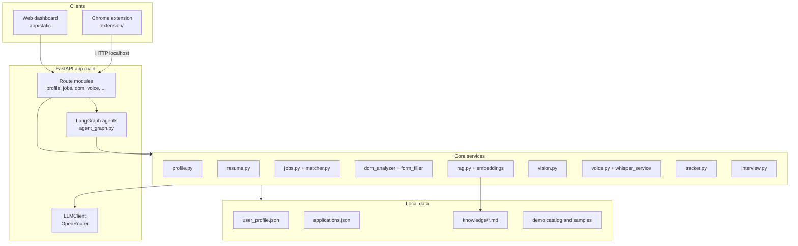

# Saarthi — Accessible Job Application Assistant

**Saarthi** is an AI-powered job application assistant designed for candidates with disabilities. It combines a FastAPI backend, an accessible web dashboard, and an optional Chrome extension so users can search roles, understand job postings, prepare profiles, practice interviews, and get help with application forms—using voice, keyboard, gestures, and screen-reader-friendly UI patterns.

The project emphasizes **user-declared accessibility preferences** (never diagnosis or inference of disability), **explicit confirmation** before submitting applications, and **conservative auto-fill** that only populates verified “safe” fields from the user profile.

---

## Table of contents

- [Features](#features)
- [Architecture](#architecture)
- [Project structure](#project-structure)
- [Requirements](#requirements)
- [Installation](#installation)
- [Configuration](#configuration)
- [Running the application](#running-the-application)
- [Chrome extension](#chrome-extension)
- [Web dashboard overview](#web-dashboard-overview)
- [API reference](#api-reference)
- [LangGraph workflows](#langgraph-workflows)
- [Data and persistence](#data-and-persistence)
- [Testing](#testing)
- [Accessibility and safety principles](#accessibility-and-safety-principles)
- [Troubleshooting](#troubleshooting)
- [License and attribution](#license-and-attribution)

---

## Features

### Accessibility-first onboarding and settings

- Multi-step onboarding: users select declared needs (e.g. blind/low vision, motor disability, dyslexia, hearing/speech considerations).
- Presets map selections to UI modes: TTS, high contrast, dyslexia-friendly typography, captions, keyboard navigation, gesture control, and more.
- Settings tab to adjust preferences and accommodation disclosure behavior for sensitive form fields.

### Profile and resume

- Upload a **PDF resume** (PyMuPDF text extraction + structured parsing, with optional LLM enrichment via OpenRouter).
- Accessible **profile builder** with completeness scoring and missing-field guidance.
- Profile stored locally in `data/user_profile.json`.

### Job search and understanding

- Search a **demo job catalog** (`data/demo/jobs_catalog.json`) with skill and work-mode aware filtering.
- **Semantic job matching** against the user profile (Sentence Transformers + cosine similarity).
- **Simplify** job descriptions, **explain** jargon, and **simplify** application questions (LLM-backed where configured).
- **Career assistant** chat grounded in job context and profile.

### Smart Apply (forms and DOM)

- Analyze HTML/DOM structure, run **heuristic accessibility audits** (labels, ARIA, required fields, etc.).
- **Field mapping** with a four-tier strategy: exact match → synonym rules → embedding similarity → ambiguous/manual review.
- **Safe fields only** for automatic population (name, email, phone, location, links, etc.).
- Sensitive topics (salary, cover letter, disability/accommodation, etc.) are flagged for user review.
- Demo application form in-dashboard; Chrome extension can scan live job sites and fill safe fields on the active tab.
- Application **submit** endpoint requires `user_confirmed: true` and logs to the tracker (no silent auto-submit).

### Application tracker

- CRUD-style tracking of applications in `data/applications.json`.
- Natural-language friendly queries via LangGraph (voice/dashboard integration).

### Interview preparation

- Generate role-aware practice questions.
- Evaluate spoken or typed answers (LLM critique when API key is set).

### Voice and vision

- **Rule-based voice intents** (search jobs, read page, fill safe fields, stop/cancel/approve, etc.).
- **LangGraph voice command pipeline** for richer routing and announcements (`POST /api/voice/command`).
- Optional **local speech-to-text** via Faster-Whisper (`POST /api/voice/transcribe`) — CPU-friendly `tiny.en` by default.
- **Vision/gesture** endpoints using MediaPipe/OpenCV: eye aspect ratio (EAR), blink patterns, head and hand gestures for hands-free navigation when enabled in settings.

### Static RAG (accessibility knowledge)

- Markdown corpus under `data/knowledge/` indexed at startup with **FAISS** + **all-MiniLM-L6-v2** embeddings.
- Query endpoint for WCAG, screen readers, keyboard navigation, voice commands, and project-specific rules.

---

## Architecture



**Request flow (typical):** browser or extension calls a REST endpoint → service layer (deterministic logic and/or LLM) → optional LangGraph orchestration → JSON response → dashboard updates UI and ARIA live regions for screen readers.

---

## Project structure

```
Saarthi/
├── app/
│   ├── main.py              # FastAPI app, CORS, static mount, health checks
│   ├── config.py            # Settings (.env), port selection, Whisper config
│   ├── llm/
│   │   └── client.py        # OpenRouter HTTP client
│   ├── routes/              # API routers (one module per domain)
│   ├── services/            # Business logic, ML helpers, LangGraph graphs
│   └── static/              # Dashboard (index.html, app.js, styles.css)
├── extension/               # Chrome MV3 extension (DOM scan, audit, fill)
├── data/
│   ├── user_profile.json    # User accessibility + resume profile (local)
│   ├── applications.json    # Application tracker records
│   ├── knowledge/           # RAG markdown sources
│   └── demo/                # Sample jobs, HTML form, job text
├── scripts/
│   └── verify_e2e.py        # 25-step end-to-end verification script
├── tests/                   # pytest suite
├── run.py                   # Uvicorn entrypoint
├── requirements.txt
└── README.md
```

---

## Requirements

- **Python 3.10+** (3.11 recommended)
- **pip** and a virtual environment
- **OpenRouter API key** (recommended for LLM features: simplify JD, career chat, interview feedback, resume enrichment)
- **Webcam** (optional, for gesture/head control features)
- **Google Chrome** (optional, for the extension)
- **Disk and network** for first-run downloads:
  - `sentence-transformers` model: `all-MiniLM-L6-v2`
  - Faster-Whisper model: `tiny.en` (if using `/api/voice/transcribe`)
  - MediaPipe / OpenCV wheels as pulled by pip

---

## Installation

From the repository root:

```powershell
python -m venv .venv
.\.venv\Scripts\Activate.ps1
pip install -r requirements.txt
```

For **local speech-to-text** (used by voice transcription tests and `/api/voice/transcribe`), also install:

```powershell
pip install faster-whisper
```

Create a `.env` file in the project root (see [Configuration](#configuration)).

---

## Configuration

Settings are loaded via **pydantic-settings** from `.env` and environment variables (`app/config.py`).

| Variable | Default | Description |
|----------|---------|-------------|
| `OPENROUTER_API_KEY` | *(empty)* | API key for [OpenRouter](https://openrouter.ai/). Required for full LLM features. |
| `OPENROUTER_MODEL` | `qwen/qwen3.8-27b:free` | Chat model slug on OpenRouter. |
| `OPENROUTER_BASE_URL` | `https://openrouter.ai/api/v1` | OpenRouter API base URL. |
| `PORT` | auto (`8000`, else fallbacks) | Server port if 8000 is busy. |
| `WHISPER_MODEL_SIZE` | `tiny.en` | Faster-Whisper model size. |
| `WHISPER_DEVICE` | `cpu` | Inference device. |
| `WHISPER_COMPUTE_TYPE` | `int8` | Quantization for CPU inference. |
| `WHISPER_LANGUAGE` | `en` | Transcription language hint. |

Example `.env`:

```env
OPENROUTER_API_KEY=sk-or-v1-your-key-here
OPENROUTER_MODEL=qwen/qwen3.8-27b:free
```

Host binding is fixed in code to **`127.0.0.1`** for local development (extension and CORS target localhost).

---

## Running the application

```powershell
python run.py
```

Open the dashboard:

**http://127.0.0.1:8000**

Useful endpoints:

| URL | Purpose |
|-----|---------|
| `/` | Accessible web dashboard |
| `/docs` | Swagger UI (FastAPI) |
| `/api/health` | Health and model configuration check |
| `/api/ai/test` | OpenRouter connectivity smoke test |

---

## Chrome extension

The extension (**Saarthi - Accessible Job Assistant**) connects to the local backend at `http://127.0.0.1:8000`.

### Load unpacked (development)

1. Start the FastAPI server (`python run.py`).
2. Open Chrome → **Extensions** → **Manage extensions** → enable **Developer mode**.
3. **Load unpacked** → select the `extension/` folder.
4. On a job application page, open the extension popup:
   - **Scan Active Page** — extract inputs, headings, buttons via `content.js`
   - **Audit Accessibility** — `POST /api/dom/audit`
   - **Fill Safe Fields** — `POST /api/dom/map-fields` then inject values for safe mappings only
   - **Open Full Dashboard** — opens the main Saarthi UI

**Note:** Refresh the target tab after installing the extension so the content script loads. Host permissions are limited to `localhost` / `127.0.0.1`.

---

## Web dashboard overview

After onboarding, the main app uses a **tabbed, ARIA-aware** layout:

| Tab | Capabilities |
|-----|----------------|
| **Profile** | Resume upload/demo, profile builder, completeness meter |
| **Job Search** | Search, matching, job details, Smart Apply demo, career assistant |
| **AI Assistant** | RAG queries over accessibility knowledge |
| **Tracker** | View/update application status |
| **Interview** | Practice questions and answer evaluation |
| **Settings** | Accessibility toggles, gesture control, system checks |

Global affordances include skip links, live region announcements, read-aloud/stop controls, voice command handling, and optional camera-based gestures when enabled.

---

## API reference

All JSON APIs are prefixed under `/api`. Interactive documentation: **http://127.0.0.1:8000/docs**.

### Core

| Method | Path | Description |
|--------|------|-------------|
| `GET` | `/api/health` | Service health, model name, API key configured flag |
| `GET` | `/api/ai/test` | LLM connection test and sample generation |

### Profile (`/api/profile`)

| Method | Path | Description |
|--------|------|-------------|
| `GET` | `/api/profile` | Full profile JSON |
| `POST` | `/api/profile/onboarding` | Apply declared accessibility needs |
| `GET` | `/api/profile/completeness` | Completeness score and checklist |
| `POST` | `/api/profile/accessibility` | Update accessibility flags |
| `POST` | `/api/profile/resume` | Update resume section |
| `POST` | `/api/profile/builder` | Save profile builder fields |

### Resume (`/api/resume`)

| Method | Path | Description |
|--------|------|-------------|
| `POST` | `/api/resume/upload` | Upload PDF resume |
| `GET` | `/api/resume/demo` | Process demo PDF if present |

### Jobs (`/api/jobs`)

| Method | Path | Description |
|--------|------|-------------|
| `POST` | `/api/jobs/parse` | Parse JD text to structured fields |
| `POST` | `/api/jobs/simplify` | Plain-language JD summary |
| `POST` | `/api/jobs/explain-term` | Explain a term in context |
| `POST` | `/api/jobs/simplify-question` | Simplify an application question |
| `POST` | `/api/jobs/search` | Search demo catalog |
| `GET` | `/api/jobs/catalog` | Raw catalog |
| `POST` | `/api/jobs/match` | Match job to user profile |
| `POST` | `/api/jobs/assistant-query` | Career assistant |
| `GET` | `/api/jobs/demo` | Load sample job description |

### DOM and forms (`/api/dom`)

| Method | Path | Description |
|--------|------|-------------|
| `POST` | `/api/dom/analyze` | Parse HTML structure |
| `POST` | `/api/dom/audit` | Accessibility heuristic report |
| `POST` | `/api/dom/map-fields` | Map inputs to profile (safe vs ambiguous) |
| `POST` | `/api/dom/submit-application` | Log application **after explicit confirmation** |
| `GET` | `/api/dom/demo-html` | Demo application HTML |

### Voice (`/api/voice`)

| Method | Path | Description |
|--------|------|-------------|
| `POST` | `/api/voice/intent` | Rule-based intent parsing |
| `POST` | `/api/voice/transcribe` | Audio file → text (Faster-Whisper) |
| `POST` | `/api/voice/command` | Full LangGraph voice workflow |

### Vision (`/api/vision`)

| Method | Path | Description |
|--------|------|-------------|
| `GET` | `/api/vision/status` | Camera/gesture subsystem status |
| `POST` | `/api/vision/process-ear` | Blink detection from landmarks |
| `POST` | `/api/vision/calculate-ear` | EAR from eye points |
| `POST` | `/api/vision/head-gesture` | Head movement commands |
| `POST` | `/api/vision/hand-gesture` | Hand gesture commands |
| `POST` | `/api/vision/command` | Unified gesture command handler |

### RAG (`/api/rag`)

| Method | Path | Description |
|--------|------|-------------|
| `POST` | `/api/rag/query` | Semantic search + optional LLM answer |
| `GET` | `/api/rag/status` | Index chunk count / readiness |

### Tracker (`/api/tracker`)

| Method | Path | Description |
|--------|------|-------------|
| `GET` | `/api/tracker` | List applications |
| `POST` | `/api/tracker` | Add application |
| `PATCH` | `/api/tracker/{app_id}` | Update status/notes |

### Interview (`/api/interview`)

| Method | Path | Description |
|--------|------|-------------|
| `POST` | `/api/interview/questions` | Generate practice questions |
| `POST` | `/api/interview/evaluate` | Score/feedback on an answer |

---

## LangGraph workflows

`app/services/agent_graph.py` defines compiled graphs used for multi-step flows:

| Graph | Purpose |
|-------|---------|
| `voice_command_graph` | Classify intent → context → execute → response/TTS text |
| `job_search_graph` | Expanded search and ranking pipeline |
| `smart_apply_graph` | DOM audit, mapping, confirmation gates |
| `tracker_query_graph` | NL queries over application history |
| `career_assistant_graph` | Grounded Q&A with job + profile context |
| `profile_pipeline_graph` | Resume/profile validation and completeness |
| `interview_prep_graph` | Question generation and evaluation steps |

Voice commands hit `voice_command_graph` via `POST /api/voice/command`. Other graphs are invoked from services and tests as the integration matures.

---

## Data and persistence

| Path | Role |
|------|------|
| `data/user_profile.json` | Accessibility settings + `resume_profile` |
| `data/applications.json` | Tracker entries |
| `data/knowledge/*.md` | RAG documents (WCAG, forms, voice commands, etc.) |
| `data/demo/jobs_catalog.json` | Demo job listings for search/match |
| `data/demo/sample_application.html` | In-app Smart Apply demo |
| `data/demo/sample_job_description.txt` | Sample JD text |

**Demo resume:** `/api/resume/demo` expects `data/demo/sample_resume.pdf`. Add your own PDF at that path for demo upload tests; otherwise use **Upload resume** in the UI.

There is no database server—persistence is **local JSON files** suitable for development and demos. Do not commit real PII; `.env` is gitignored.

---

## Testing

Run the full pytest suite:

```powershell
pytest
```

Run a focused file:

```powershell
pytest tests/test_health_and_config.py -v
```

End-to-end verification script (health, OpenRouter, resume, RAG, DOM, vision, voice, API integration):

```powershell
python scripts/verify_e2e.py
```

Some tests require:

- `OPENROUTER_API_KEY` for live LLM calls
- `faster-whisper` installed for transcription tests
- `data/demo/sample_resume.pdf` for resume demo steps in `verify_e2e.py`

First pytest run may be slow while embedding and Whisper models download.

---

## Accessibility and safety principles

1. **User-declared needs only** — onboarding copies explicit selections into preferences; the app does not infer disability.
2. **No silent submission** — `/api/dom/submit-application` rejects requests without `user_confirmed: true`.
3. **Conservative auto-fill** — only whitelisted safe fields; salary, essays, and accommodation-related fields require review.
4. **Accommodation disclosure** — profile setting controls how accommodation-related questions are handled (`never`, `ask_every_time`, etc.).
5. **Stop and confirm** — voice intents include STOP, APPROVE, DENY, and submit confirmation flows.
6. **Local-first option** — STT can run locally via Faster-Whisper; LLM calls go to OpenRouter when configured.

---

## Troubleshooting

| Issue | What to try |
|-------|-------------|
| Port already in use | Set `PORT=8765` in `.env` or stop the other process; config tries fallbacks automatically. |
| LLM features empty or errors | Set `OPENROUTER_API_KEY` in `.env`; check `/api/ai/test` and `/api/health`. |
| RAG returns no results | Ensure `data/knowledge/` contains `.md` files; restart server to rebuild FAISS index. |
| Extension “content script” error | Reload the job page after installing the extension. |
| Transcription fails | `pip install faster-whisper`; first run downloads the Whisper model. |
| Gesture/camera errors | Grant browser camera permission; enable gestures in Settings. |
| Slow first request | SentenceTransformer and Whisper load lazily on first use. |

---

## License and attribution

This repository is an educational / assistive-technology project (**Accessible Job Application Assistant**, internal reference PS003 in verification scripts). Add your license file here if you distribute the project publicly.

**Third-party stack (non-exhaustive):** FastAPI, Uvicorn, LangGraph, OpenRouter-compatible models, Sentence Transformers, FAISS, PyMuPDF, MediaPipe, OpenCV, Faster-Whisper.

---

## Quick start checklist

- [ ] Create venv and `pip install -r requirements.txt`
- [ ] Optional: `pip install faster-whisper`
- [ ] Add `OPENROUTER_API_KEY` to `.env`
- [ ] `python run.py` → open http://127.0.0.1:8000
- [ ] Complete accessibility onboarding
- [ ] Upload resume or use profile builder
- [ ] Optional: load Chrome extension from `extension/`
- [ ] Run `pytest` or `python scripts/verify_e2e.py` to validate setup
